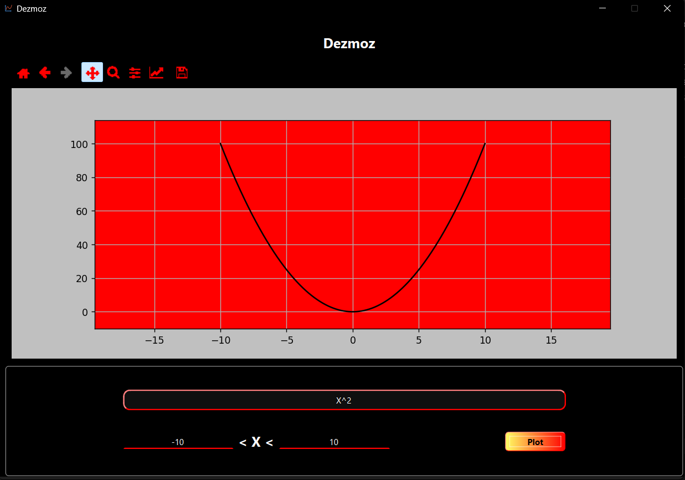
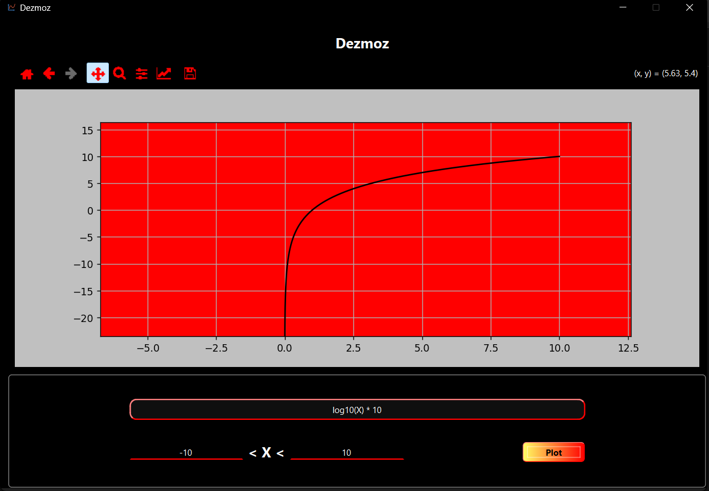
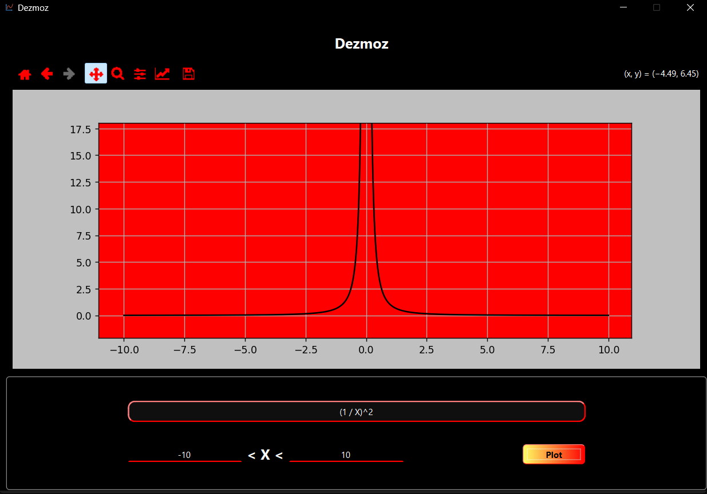
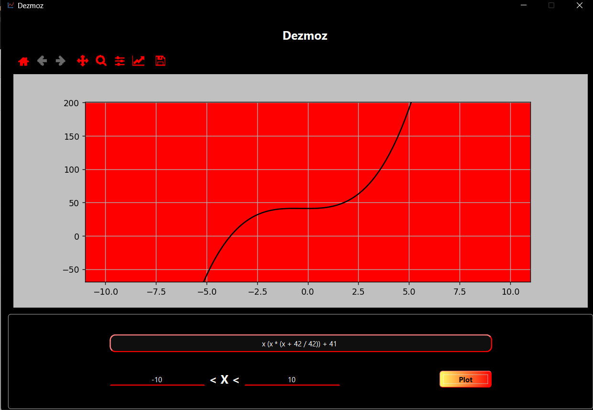
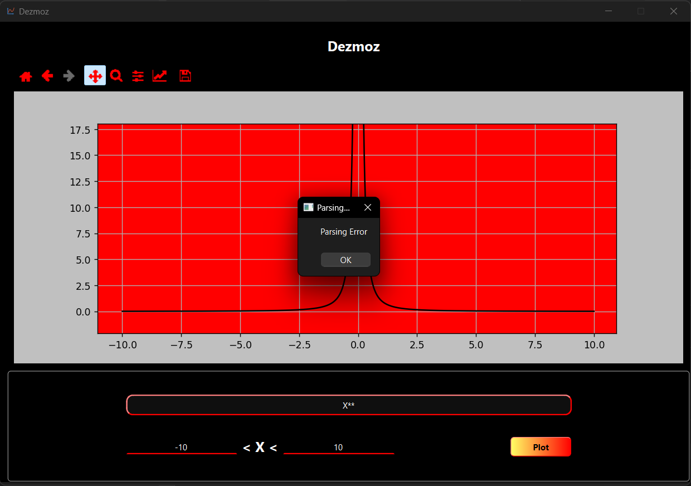
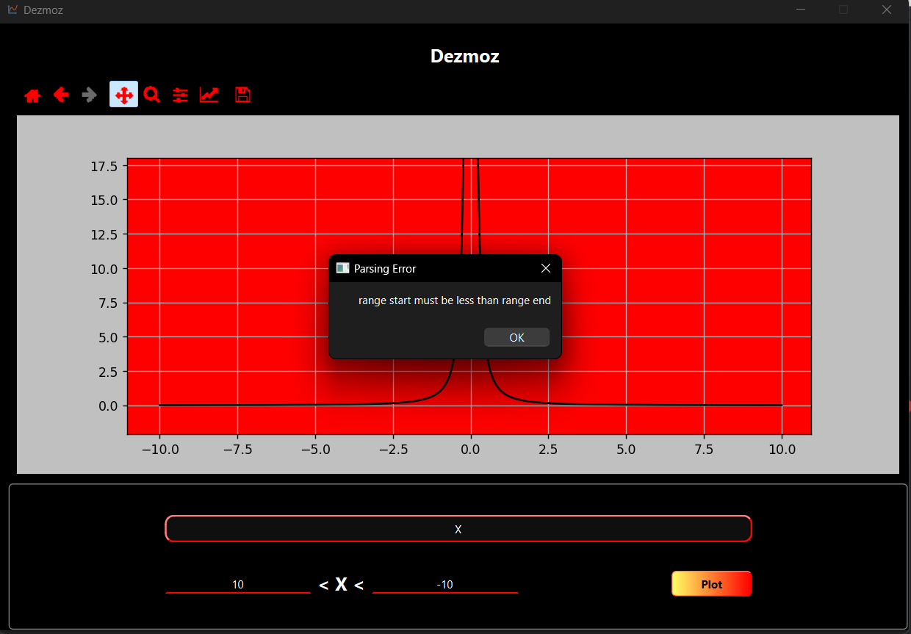

# Dezmoz
Function Plotter Using PySide6 - Matplotlib libraries
# Implementation Overview
For The UI, PySide6 and QT Designer Was Used To Make A Simple Form Application That Supports Recording User Inputs And Showing The Plotting For The Function.  
The Server Was Made Manually Without Using Any Ready Made Functionalities. It Contains The Set Of The Following Features:-
-  Converting The Equation To A Tokenized Form So That It Can Be Processed Easily
- Building The Solution Tree In Which The Operations Should Be Done To Get The Final Answer, Imagine The Equation As A Tree With Internal Nodes Representing The Brackets And The Leaves Are Equation In A Standard Form
- Substituting X Into The Tree To Get The Final Answer.

# Features  
- it can plot any function in one variable (X)
- The application supports these set of operators 
    - \+ 
    - \-
    - \*
    - \\
    - \^
    - log10( f(x) )
    - sqrt(f(x))
    - (f(x)) operator (g(x))
- error handling
- simple & beautiful UI using PySide6 library
- Navigation Inside The Plotted Function (Supporting Zoom - Hover Over Points - Scrolling)
# Usage
in Application Folder, run the following command
`python Runner.py`, and the program should be running right away.

- Note that this script will check if the required libraries are installed and will ask for acceptance of the user if some libraries are missing to start installation using pip install command.

# Examples
|  |  |
|---|---|
|  | .png) |
||  |

# Error Handling Examples
|||
|---|---|
|||

# Dependencies
- Python v3.x
- PySide6
- Matplotlib
- Regex
